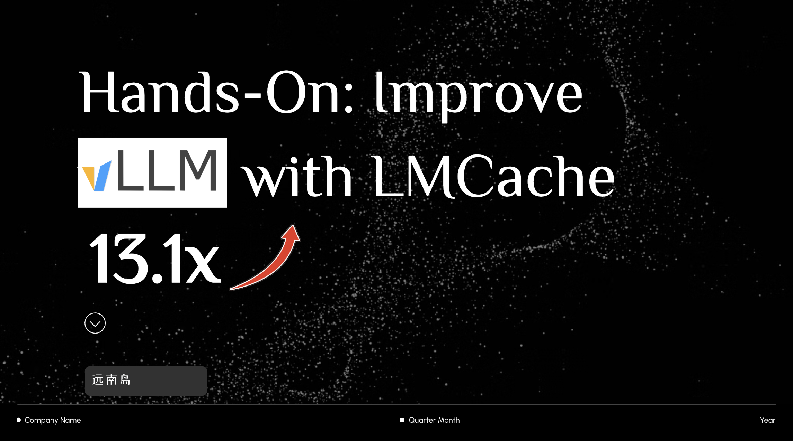

# Tutorial to Use LMCache within Nvidia Dynamo



### Quick start
```
docker compose -f deploy/docker-compose.yml --profile metrics up -d

./container/run.sh --framework vllm -it --mount-workspace

# Install nvshem
pip install --upgrade pip
pip install --extra-index-url https://pypi.nvidia.com \
    nvidia-nvshmem-cu12 nvshmem4py-cu12

# 2) (Often already set, but harmless) expose libs on the path
export NVSHMEM_HOME=/usr/local
export LD_LIBRARY_PATH=/usr/local/lib:$LD_LIBRARY_PATH

# 3) Sanity check
python -c "import nvshmem; print('nvshmem OK:', getattr(nvshmem,'__version__','unknown'))"

# serve 
export ENABLE_LMCACHE=1
export LMCACHE_CHUNK_SIZE=256
export LMCACHE_LOCAL_CPU=True
export LMCACHE_MAX_LOCAL_CPU_SIZE=64

./components/backends/vllm/launch/agg_lmcache.sh

# Test a prompt
curl localhost:8000/v1/chat/completions   -H "Content-Type: application/json"   -d '{
    "model": "Qwen/Qwen3-0.6B",
    "messages": [
    {
        "role": "user",
        "content": "What is the capital of US"
    }
    ],
    "stream":false,
    "max_tokens": 30
  }'
  
# Run the script
python cpu-offloading.py
python cpu-offloading.py --enable-lmcache
```

