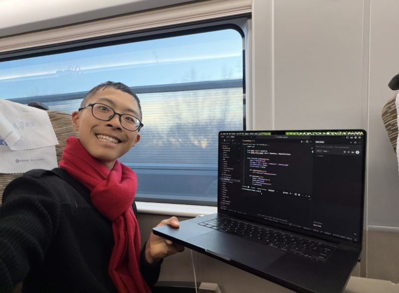

# How to Set Up a Lab GPU and Share It with the Entire ML Team
(DGX Spark SSH in 3 Steps)



## Why
Local GPUs do not scale. A powerful GPU sitting in a bedroom or office becomes unusable once the owner travels. This guide shows how to expose a lab GPU over SSH so it remains accessible from anywhere while staying physically in an approved lab space.

## How

### Step 1: Install and enable SSH on the server

```bash
sudo apt update
sudo apt install openssh-server
```

Allow SSH through the firewall:

```bash
sudo ufw allow ssh
```

If ufw is not installed or not enabled, proceed without this step.

### Step 2: Configure network identity (IP and MAC)

Run:

```bash
ifconfig
```

Identify the correct network interface:

* Choose the interface with the highest RX/TX traffic
* Record the IPv4 address from `inet` (ignore `inet6`)
* Record the MAC address from `ether`

Example:

```
inet 10.110.41.16
ether 4c:bb:47:2a:bb:88
```

Provide the IP address and MAC address to your university or lab IT team and request that the machine be added to the approved device list.

### Step 3: Create a user and access the server

Create a new user:

```bash
sudo adduser jane
```

Grant sudo access:

```bash
sudo usermod -aG sudo jane
```

Connect your laptop to the university VPN (e.g., Cisco AnyConnect).
Once connected, your machine is logically inside the campus network.

SSH into the server:

```bash
ssh jane@10.110.41.16
```

### What You Get

* Remote access to the lab GPU from anywhere (home, dorm, train, airplane)
* A single GPU shared across the entire lab
* Hardware remains in compliant, approved lab space


## Next Steps
Finetuning with PyTorch: https://build.nvidia.com/spark/pytorch-fine-tune
