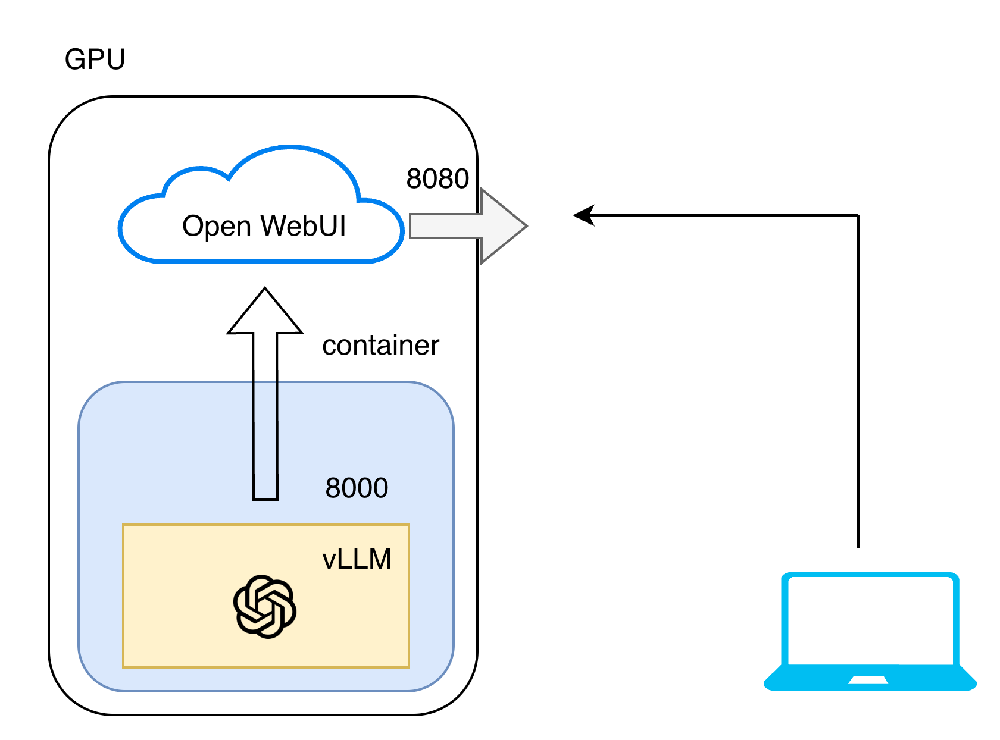

# How to Deploy a Model on vLLM with Local GPU



## Step 1: Launch the Docker Container

Find the latest container build from https://catalog.ngc.nvidia.com/orgs/nvidia/containers/vllm

Configure the container with:
- Export HuggingFace token for model authentication
- Mount HuggingFace cache to download models once and reuse
- Expose port 8000 for vLLM endpoint
- Enable all GPUs

```bash
export HF_TOKEN="xxx"

docker run -it --gpus all -p 8000:8000 \
  -v ~/.cache/huggingface:/root/.cache/huggingface \
  --env HF_TOKEN="$HF_TOKEN" \
  --name my_container \
  nvcr.io/nvidia/vllm:25.12.post1-py3 \
  bash
```

## Step 2: Start the vLLM Server

Launch vLLM using the same port exposed in the container:

```bash
vllm serve openai/gpt-oss-20b --host 0.0.0.0 --port 8000
```

Additional flags (adjust memory utilization if out of memory):

```bash
--gpu-memory-utilization 0.8
```

Test the deployment:

```bash
curl http://localhost:8000/v1/chat/completions \
  -H "Content-Type: application/json" \
  -d '{
    "model": "openai/gpt-oss-120b",
    "messages": [{"role": "user", "content": "12*17"}],
    "max_tokens": 500
  }'
```

## Step 3: Deploy Open WebUI

Pull and launch the Open WebUI container:

```bash
docker run \
  -it \
  -e OPENAI_API_BASE_URL="http://localhost:8000/v1" \
  -v open-webui:/app/backend/data \
  --network host \
  --add-host=host.docker.internal:host-gateway \
  --name open-webui \
  --restart always \
  ghcr.io/open-webui/open-webui:main
```

### Remote Access via SSH

If connecting to your GPU remotely, set up port forwarding:

```bash
ssh -L 8080:localhost:8080 spark
```

Open your web browser and navigate to `http://localhost:8080`